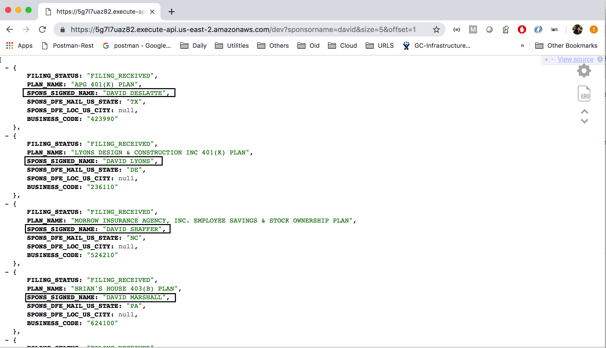

# AWS Elastic Search - Search Microservice

## Project Requirement

Using Java, write a micro service that invokes AWS elastic search and make it available using API gateway.             

1. Test Data - http://askebsa.dol.gov/FOIA%20Files/2017/Latest/F_5500_2017_Latest.zip             
2. Search should be allowed by Plan name, Sponsor name and Sponsor State             
3. Use AWS best practices              

## Deliverbales - Amazon  API Gateway based Microservice API's

### Following are the three API's developed with and without paginaton.

#### With Pagination , You can mentione the number of records along with the offset.
#### Without Pagination , By default every  API returns Max 10 records. 

### Search by Sponsor Name

#### Without Pagination 
https://5g7l7uaz82.execute-api.us-east-2.amazonaws.com/dev?sponsorname=david

#### With Pagination
https://5g7l7uaz82.execute-api.us-east-2.amazonaws.com/dev?sponsorname=david&size=5&offset=1

### Sample Output

### Search by Sponsor State

#### Without Pagination  
https://5g7l7uaz82.execute-api.us-east-2.amazonaws.com/dev?sponsorstate=TX

#### With Pagination 
https://5g7l7uaz82.execute-api.us-east-2.amazonaws.com/dev?sponsorstate=TX&size=12&offset=1

### Sample Output

### Search by Plan Name

#### Without Pagination , By default this API returns Max 10 records. 
https://5g7l7uaz82.execute-api.us-east-2.amazonaws.com/dev?planname=401k

#### With Pagination , You can mentione the number of records along with the offset.
https://5g7l7uaz82.execute-api.us-east-2.amazonaws.com/dev?planname=401k&size=2&offset=1

### Sample Output

## System  Architecture
description 

## AWS Elastic Search
description 

## Data Ingestion
description 

## Elastic Container Service
description 

## Load Balancer
description 

## API Gateway
description 

## Unit Testing

## Unit Testing
Unit testing is an integral part of agile development principles.

## Possible Enhancements
*
*

