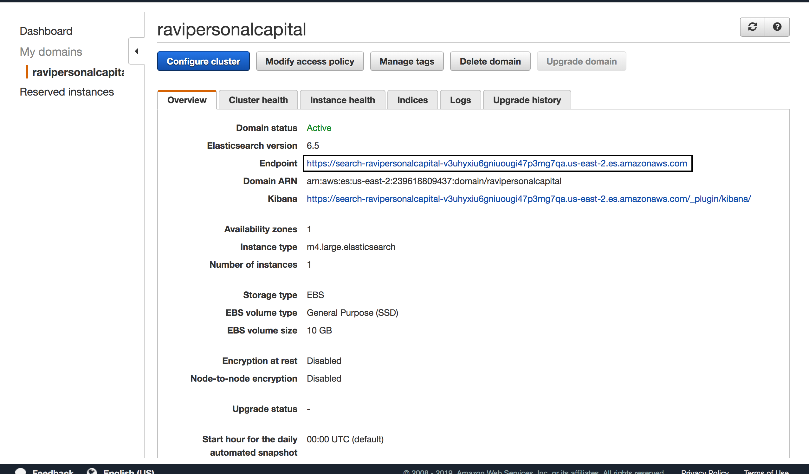
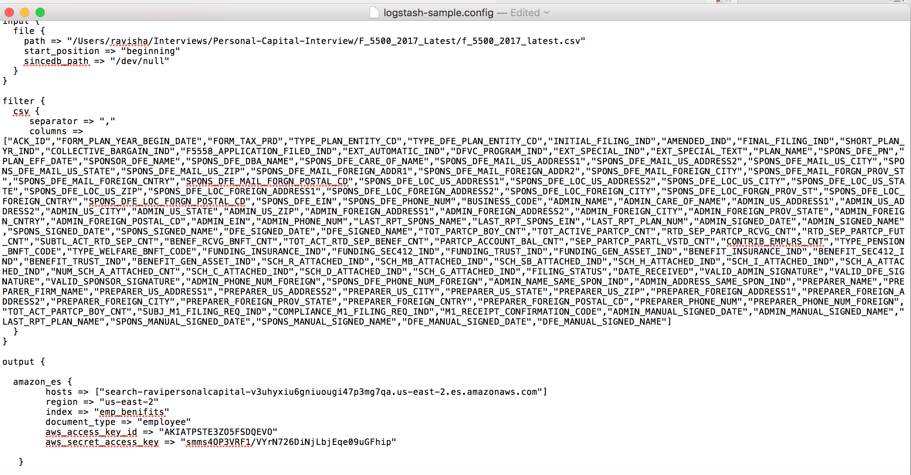

# AWS Elastic Search - Search Microservice

## Project Requirement

Using Java, write a micro service that invokes AWS elastic search and make it available using API gateway.             

1. Test Data - http://askebsa.dol.gov/FOIA%20Files/2017/Latest/F_5500_2017_Latest.zip             
2. Search should be allowed by Plan name, Sponsor name and Sponsor State             
3. Use AWS best practices        

## System  Architecture
Following are the different AWS componenents leveraged for building highy avalabile and scalable
system. 

  

## Service  Architecture
Spring boot is used to develop the complete  micro service system, following is the high
level micro service acrchitecture of the services in the system.

       

## Final Deliverables 

Following are the three  Amazon  API Gateway based Microservice API's  developed with and without paginaton with above architecture 
in place. you can pass query string sponsorname, sponsorstate or  planname  with required value.
along with this query parameter , you can use pagination as required.  

* With Pagination : You can mention the number of records along with the offset.
* Without Pagination : By default every  API returns Max 10 records. 

### Search by Sponsor Name

* ##### Without Pagination 
https://5g7l7uaz82.execute-api.us-east-2.amazonaws.com/dev?sponsorname=david

* ##### With Pagination
https://5g7l7uaz82.execute-api.us-east-2.amazonaws.com/dev?sponsorname=david&size=5&offset=1

### Sample Output

### Search by Sponsor State

#### Without Pagination  
https://5g7l7uaz82.execute-api.us-east-2.amazonaws.com/dev?sponsorstate=TX

#### With Pagination 
https://5g7l7uaz82.execute-api.us-east-2.amazonaws.com/dev?sponsorstate=TX&size=12&offset=1

### Sample Output

### Search by Plan Name

#### Without Pagination , By default this API returns Max 10 records. 
https://5g7l7uaz82.execute-api.us-east-2.amazonaws.com/dev?planname=401k

#### With Pagination , You can mentione the number of records along with the offset.
https://5g7l7uaz82.execute-api.us-east-2.amazonaws.com/dev?planname=401k&size=2&offset=1

### Sample Output

## System Components
Following are the different componets used in the system  

## AWS Elastic Search

Elasticsearch is an open-source, RESTful, distributed search and analytics engine built on Apache Lucene, when it comes to 
Amazon Elasticsearch Service, it  is a fully managed service that is provided by amazon, Basically it provides two different services
one is a single node service and the other is a clustered service with different master nodes and deploying them in different
availability zones for high availability. Along with this  it also offers Kibana a visual dashbaord by default when
we subscribe for Elastic search service. It also provides certain plugins with different log shippers like logstash for 
pushing the required data. 

## Configuartion 

## Data Ingestion
There are different data ingestion tools data for ingesting the data. in the same context we 
use the term log shippers , there are different log shippers available in todays cloud world
like Filebeat, Logstash, Fluentd, etc. I had leveraged logstash here for ingesting the test
data into elatic search server as Amazon provides elastic search output channel plugin that can
be used with logstash, this plugin helped me in pushing the huge csv file into elastic search
by doing bulk upload. 

## Configuartion   

## Elastic Container Service
Containers are the next level of virtual computing that came after virtual machines. 
containers are easily deployable with different services like docker, rocket etc. Containers
are the most frequently used packaging component in today cloud world. Therefore container orchestartion
is the most important task in todays container world, Today we ave different container orchestartion
frameworks like Kubernetes, Docker Swarm and many managed services like GKE, AKE, OKE and ECS.
I had levaraged ECS from Amazon for container orchestartion services by leveraged the autoscaling group\
which provides high availability. 

## Cluster Details 

## Configuartion

## Load Balancer
Load balancer provides high availability to the system, so i had leveraged elastic load balancer 
provided by AWS deployed across multiple Availability Zones. Load balancer in my current system
talks to ECS for provding the required services. One point to note here is i had leveraged
spring actuator health endpoint for getting the health of the system. 
 
## Configuartion 

## API Gateway
API Gateway is one of the design pattern that is used with micro service based architecture, It acts as a single point of entry
for all the micro services in the system. Amazon provdes the same system with the component named
Amazon API Gateway. Apart from acting as a single point of entry, Amazon API gateway provides numerous
other features like authenication, documentation, Testing, monetization , Securing from DDOS attacks and 
many more.  

### API Creation

### API Configuration

API Gateway Configuation for the given API, if you see on the right side of the image here, we 
can see the reference to load balancer. In the current System API gateway is configured to load balancer
which inturn is pointed to ECS for better availability. 
 

## Docker - Image

### Steps
1. Build a docker image of the Spring Boot application
2. Push the Docker image to dockerhub

My Docker Repo , where the docker image is published. 

### Gradle Docker
Gradle kick starting building and  pushing of Docker image  to docker hub

## Unit Testing
Unit testing is an integral part of agile development principles. Today we have different framework like junit, mockito
any many other frameworks, in the current system i had leveraged a framework called spock.

Spock is a testing and specification framework for Java and Groovy applications. 

Why Spock?

* it is Extremely expressive , we can just use english sentences to name the Testing methods
* Facilitates the Given/When/Then syntax for your tests, where given is the inputs, when is execution and then is final validation of your results
* Compatible with most IDEs and CI Servers.

You can find more information here,
https://dzone.com/articles/adapter-design-pattern-video

### Unit Test Results
All the three Rest API are unit tested and the results are 100% clean, attached the results
for reference for the same.

## Possible Enhancements

Application can be extended with more capabilities by adding some of the following features.

* Route  53 can be configured to API Gateway to levarge more DNS capabilities.
* Configuration management can be done using AWS cloudformation and AWS Service catalog.
* Lambda authorizers and Amazon Cognito user pools can be leveraged for rest authentication solutions.
* Kibana an extra service that  comes by default when you subscribe for Elastic search in AWS can be levaraged for log mangement.

## Conclusion
Finally to conclude, This is a wonderfull excercise that gave me opportunity to look and work on different components of AWS and look into the 
system in a more broad way. in fact We can leverage many more feature from AWS to enhance the system as per the requirements. Any corner you think of either its
on analytics , Machine learning , IOT or any use case,  we can pretty much leverage AWS and other public cloud services. 

Some of my articles  in the context of cloud computing.

* https://ravishajava.com/2018/08/11/my-case-study-on-publicly-available-cloud-migration-coca-cola-cloud-journey/
* https://ravishajava.com/2018/08/10/log-management-kubernetes/
* https://ravishajava.com/2018/08/08/elasticsearch-datasource-grapahana/

