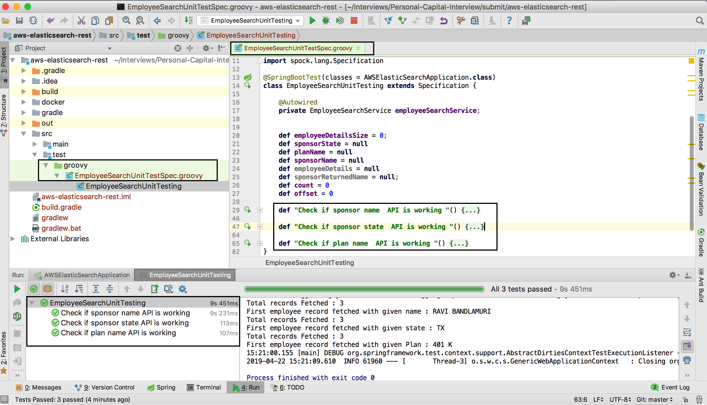

# AWS Elastic Search - Search Microservice

## Project Requirement

Using Java, write a micro service that invokes AWS elastic search and make it available using API gateway.             

1. Test Data - http://askebsa.dol.gov/FOIA%20Files/2017/Latest/F_5500_2017_Latest.zip             
2. Search should be allowed by Plan name, Sponsor name and Sponsor State             
3. Use AWS best practices              

## API Documentation
### Search by Sponsor Name

### Search by Sponsor State

### Search by Plan Name

## AWS  Architecture
description 

## AWS Elastic Search
description 

## Data Ingestion
description 

## Elastic Container Service
description 

## Load Balancer
description 

## API Gateway
description 

## Unit Testing
Automated unit testing is an integral part of agile development principles.

## Possible Enhancements
*
*

